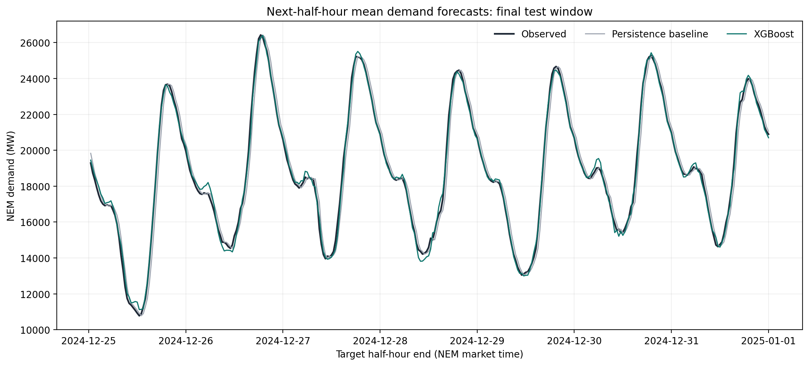

# Measured operational-demand pilot: October–December 2024

This run forecasts the next half-hour mean operational demand across the five
NEM regions. It was completed on 6 September 2026 using AEMO's original measured
half-hour series and the [protocol recorded before evaluation](protocol.md).

## Results

Both machine-learning models reduced average error relative to the three
baselines on the final test period. Random forest had the lowest test MAE,
177.94 MW, compared with 487.30 MW for persistence. XGBoost was close at
183.37 MW. On validation, XGBoost had the lowest MAE. These comparisons describe
this quarterly pilot; they do not establish a stable ranking across seasons.

All errors below are in MW; lower is better. Each evaluation split has
612 successive one-step forecasts.

| Method | Validation MAE | Validation RMSE | Test MAE | Test RMSE |
|---|---:|---:|---:|---:|
| Persistence | 483.99 | 589.17 | 487.30 | 625.06 |
| Previous day | 1809.76 | 2566.65 | 1026.53 | 1441.11 |
| Previous week | 1755.61 | 2426.36 | 2134.83 | 3274.83 |
| XGBoost | 255.75 | 553.33 | 183.37 | 237.88 |
| Random forest | 275.90 | 590.31 | 177.94 | 236.74 |

## Data and split

The source contains 22,080 regional observations and 4,416 complete NEM half
hours, with no missing intervals or conflicting duplicates. Seven-day history
requirements leave 4,080 forecast examples.

| Split | Forecast origins, AEST (UTC+10) | Examples |
|---|---|---:|
| Training | 8 Oct 2024 00:00 – 6 Dec 2024 11:30 | 2,856 |
| Validation | 6 Dec 2024 12:00 – 19 Dec 2024 05:30 | 612 |
| Test | 19 Dec 2024 06:00 – 31 Dec 2024 23:30 | 612 |

Each origin predicts the half hour starting then. The final target ends at
1 January 2025 00:00. Models use fixed settings and seed 42; the test models
were fitted once on all training and validation examples. Later test forecasts
use observations from earlier in the test period as they become complete.

## Source checks

The archive reproduces three independently published observations in
[AEMO's Q4 2024 report](https://aemo.com.au/-/media/files/major-publications/qed/2024/qed-q4-2024.pdf),
pages 12–13:

| Observation | Half-hour ending, AEST | Published and reproduced MW |
|---|---|---:|
| NEM quarterly maximum | 16 Dec 2024 18:00 | 33,716 |
| NEM quarterly minimum | 26 Oct 2024 11:30 | 10,073 |
| South Australian quarterly minimum | 19 Oct 2024 13:00 | −205 |

These checks support the interval-end convention and retention of valid
negative regional readings. The source uses `OPERATIONAL_DEMAND` directly,
without adding adjustment or WDR-estimate fields. Archive hashes and download
URLs are preserved in [source_manifest.json](source_manifest.json).

## Inspect and reproduce

Follow the commands in the [main README](../../README.md#run-the-project).
Keep the recorded archive snapshots to reproduce their exact input hash;
later AEMO revisions may change a fresh download.

- [metrics.csv](metrics.csv): complete validation and test results.
- [test_predictions.csv](test_predictions.csv): actual values and all five forecasts.
- [split_manifest.json](split_manifest.json): code hashes, environment, settings,
  splits, and the matching source-manifest hash.
- [source_checks.json](source_checks.json): independent published-value checks.
- [verification.json](verification.json): 47 passing tests, artifact checks, and
  independent recalculation of test errors.
- [SHA256SUMS](SHA256SUMS): hashes of the retained files.

The chart below shows XGBoost and persistence over the final seven test days.
Random-forest predictions and all baselines are available in the CSV above.

The [feature-importance plot](xgboost_feature_importance.png) describes the
fitted XGBoost model. Historical observations dominate this short-horizon task.

## Interpretation and attribution

The test covers roughly thirteen days near the end of one quarter. A broader
study should evaluate additional seasons and consider weather inputs. This
backtest assumes completed measurements are immediately available and uses
retrospective archive values, including later corrections.

Source: Australian Energy Market Operator (AEMO),
[measured operational-demand data](https://www.aemo.com.au/energy-systems/electricity/national-electricity-market-nem/data-nem/operational-demand-data).
Derived results were calculated by this repository. Raw monthly archives are
not redistributed. AEMO material remains subject to its
[copyright permissions](https://www.aemo.com.au/privacy-and-legal-notices/copyright-permissions);
the repository's BSD licence applies to its code.
